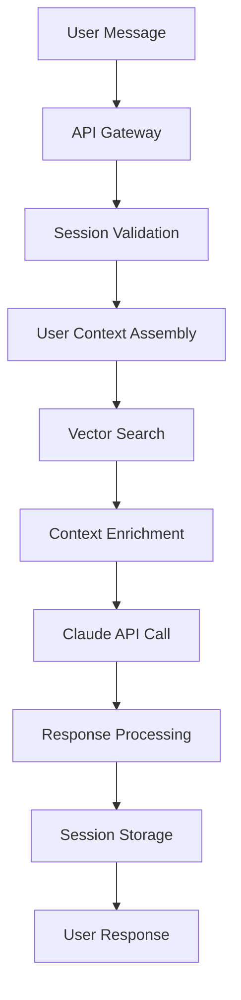
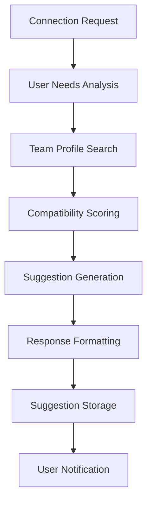
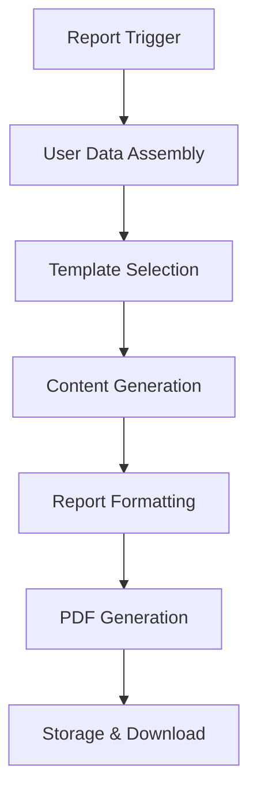

# Data Flow Documentation - AI Coaching System

## 🔄 Overview

The AI Coaching System orchestrates data flow between multiple components to deliver personalized coaching experiences. This document details how data moves through the system, from initial user input to final AI-generated responses.

## 📊 System Components

```
User Interface
    ↓
API Gateway
    ↓
PostgreSQL Database ←→ Vector Database (ChromaDB)
    ↓
Claude API (Bedrock)
    ↓
Response Processing
    ↓
User Interface
```

## 🎯 Core Data Flow Patterns

### **1. Coaching Conversation Flow**



**Detailed Steps:**

1. **User Message Reception**
   ```typescript
   POST /api/coaching/session/:sessionId/message
   {
     "message": "I'm struggling with team communication"
   }
   ```

2. **Session Validation & Context Loading**
   ```sql
   SELECT 
     cs.conversation,
     u.first_name,
     upe.ast_profile_summary,
     upe.company,
     upe.role
   FROM coaching_sessions cs
   JOIN users u ON cs.user_id = u.id
   LEFT JOIN user_profiles_extended upe ON u.id = upe.user_id
   WHERE cs.id = $sessionId AND cs.user_id = $userId;
   ```

3. **Vector Knowledge Search**
   ```typescript
   // Search for relevant coaching guidance
   const knowledgeResults = await vectorDB.searchCoachingContext(
     `User challenge: ${userMessage}
      Primary strength: ${userContext.primaryStrength}
      Role: ${userContext.role}`,
     {
       collection: 'ast_knowledge_base',
       limit: 5,
       filters: { category: ['methodology', 'coaching_patterns'] }
     }
   );
   ```

4. **Context Assembly for Claude**
   ```typescript
   const claudePrompt = `
   You are a helpful colleague coaching ${userContext.firstName}.
   
   User Context:
   - Role: ${userContext.role} at ${userContext.company}
   - Primary Strength: ${userContext.primaryStrength}
   - Recent conversation: ${lastMessages}
   
   Relevant Knowledge:
   ${knowledgeResults.map(r => r.content).join('\n')}
   
   User Message: "${userMessage}"
   
   Respond as a supportive colleague, naturally referencing their strengths without being obvious about it.
   `;
   ```

5. **Claude API Interaction**
   ```typescript
   const response = await bedrockClient.send(new InvokeModelCommand({
     modelId: 'anthropic.claude-3-sonnet-20240229-v1:0',
     contentType: 'application/json',
     accept: 'application/json',
     body: JSON.stringify({
       messages: [{ role: 'user', content: claudePrompt }],
       max_tokens: 500,
       temperature: 0.7
     })
   }));
   ```

6. **Response Processing & Storage**
   ```typescript
   const updatedConversation = [
     ...currentConversation,
     {
       role: 'user',
       content: userMessage,
       timestamp: new Date().toISOString()
     },
     {
       role: 'assistant', 
       content: claudeResponse,
       timestamp: new Date().toISOString(),
       contextSources: knowledgeResults.map(r => r.id)
     }
   ];
   
   await db.update(coachingSessions)
     .set({ 
       conversation: updatedConversation,
       contextUsed: { knowledgeBase: knowledgeResults.map(r => r.id) }
     })
     .where(eq(coachingSessions.id, sessionId));
   ```

### **2. Team Connection Flow**



**Detailed Process:**

1. **Connection Request Processing**
   ```typescript
   POST /api/coaching/connections/suggest
   {
     "challenge": "Need help with mobile UX research methodology",
     "skillsNeeded": ["User Research", "Mobile UX", "Usability Testing"],
     "collaborationType": "consultation"
   }
   ```

2. **User Context Enrichment**
   ```sql
   SELECT 
     upe.*,
     wd.starcard,
     wd.flow_attributes
   FROM user_profiles_extended upe
   JOIN workshop_data wd ON upe.user_id = wd.user_id
   WHERE upe.user_id = $requestorId;
   ```

3. **Vector Search for Team Members**
   ```typescript
   const searchQuery = `
   Challenge: ${request.challenge}
   Skills needed: ${request.skillsNeeded.join(', ')}
   Collaboration type: ${request.collaborationType}
   Seeking team member with complementary expertise.
   `;
   
   const teamResults = await vectorDB.findCollaborators(searchQuery, {
     company: userContext.company,
     excludeUserId: requestorId,
     includeMetadata: ['role', 'primary_strength', 'availability']
   });
   ```

4. **Compatibility Analysis**
   ```typescript
   const scoredSuggestions = teamResults.map(candidate => {
     const semanticMatch = 1 - candidate.distance; // 0-1 score
     const strengthComplement = calculateStrengthSynergy(
       userContext.primaryStrength,
       candidate.metadata.primary_strength
     );
     const availabilityBonus = candidate.metadata.availability === 'available' ? 0.2 : 0;
     
     const totalScore = (semanticMatch * 0.6) + 
                       (strengthComplement * 0.3) + 
                       availabilityBonus;
     
     return {
       ...candidate,
       totalScore,
       reasoning: generateCollaborationReasoning(userContext, candidate)
     };
   }).sort((a, b) => b.totalScore - a.totalScore);
   ```

5. **Suggestion Storage & Notification**
   ```sql
   INSERT INTO connection_suggestions (
     requestor_id, suggested_collaborator_id, reason_type, 
     reason_explanation, context, status
   ) VALUES (
     $requestorId, $collaboratorId, 'expertise_match',
     $reasoning, $challenge, 'suggested'
   );
   ```

### **3. Holistic Report Generation Flow**



**Data Assembly Process:**

1. **Comprehensive User Data Collection**
   ```sql
   WITH user_complete_data AS (
     SELECT 
       u.id, u.first_name, u.last_name, u.email,
       
       -- AST Workshop Data
       wd.starcard,
       wd.flow_assessment,
       wd.wellbeing_level,
       wd.future_wellbeing_level,
       
       -- Reflection Data
       sr.strength1, sr.strength2, sr.strength3, sr.strength4,
       sr.team_values, sr.unique_contribution,
       
       -- Well-being Data
       cl.current_factors, cl.future_improvements,
       cl.quarterly_progress, cl.quarterly_actions,
       
       -- Future Vision
       fs.twenty_year_vision, fs.ten_year_milestone,
       fs.five_year_foundation, fs.flow_optimized_life,
       
       -- Final Insights
       fr.future_letter_text,
       
       -- Extended Profile
       upe.company, upe.role, upe.expertise_areas
       
     FROM users u
     LEFT JOIN workshop_data wd ON u.id = wd.user_id
     LEFT JOIN step_reflections sr ON u.id = sr.user_id  
     LEFT JOIN cantril_ladder cl ON u.id = cl.user_id
     LEFT JOIN future_self fs ON u.id = fs.user_id
     LEFT JOIN final_reflection fr ON u.id = fr.user_id
     LEFT JOIN user_profiles_extended upe ON u.id = upe.user_id
     WHERE u.id = $userId
   )
   ```

2. **Report Content Generation via Claude**
   ```typescript
   const reportPrompt = `
   Generate a comprehensive holistic development report for ${userData.firstName} ${userData.lastName}.
   
   ASSESSMENT DATA:
   Star Card Strengths: ${JSON.stringify(userData.starcard)}
   Flow Assessment: Score ${userData.flowAssessment.score}/60 (${userData.flowCategory})
   Well-being: Current ${userData.wellbeingLevel}/10, Target ${userData.futureWellbeingLevel}/10
   
   REFLECTION DATA:
   Strength Applications: 
   - ${userData.strength1}
   - ${userData.strength2}
   Team Values: ${userData.teamValues}
   Unique Contribution: ${userData.uniqueContribution}
   
   FUTURE VISION:
   20-Year Vision: ${userData.twentyYearVision}
   10-Year Milestone: ${userData.tenYearMilestone}
   5-Year Foundation: ${userData.fiveYearFoundation}
   
   GROWTH PLANNING:
   Current Well-being Factors: ${userData.currentFactors}
   Quarterly Actions: ${userData.quarterlyActions}
   Key Insight: ${userData.futureLetterText}
   
   Generate a 6-page structured report with:
   1. Executive Summary
   2. Strengths Analysis  
   3. Flow State Profile
   4. Well-being Journey
   5. Future Vision & Growth Plan
   6. Team Collaboration & Next Steps
   
   Use a supportive, growth-oriented tone. Include specific quotes from their reflections.
   `;
   
   const reportContent = await claude.generateReport(reportPrompt);
   ```

3. **PDF Generation & Storage**
   ```typescript
   const pdfBuffer = await generatePDF({
     content: reportContent,
     template: 'holistic-report',
     branding: 'ast-workshop',
     charts: {
       starCard: userData.starcard,
       wellbeingLadder: {
         current: userData.wellbeingLevel,
         target: userData.futureWellbeingLevel
       }
     }
   });
   
   // Store in S3 for download
   const downloadUrl = await s3.uploadReport(
     `reports/${userId}/holistic-report-${Date.now()}.pdf`,
     pdfBuffer
   );
   ```

## 🔄 Data Synchronization Patterns

### **Workshop Completion → Extended Profile Sync**

```typescript
// Triggered when user completes AST workshop
async function syncWorkshopToProfile(userId: string) {
  // 1. Fetch completed workshop data
  const workshopData = await db.select()
    .from(workshopData)
    .where(eq(workshopData.userId, userId));
  
  // 2. Process into coaching-friendly format
  const astProfileSummary = {
    primaryStrength: calculatePrimaryStrength(workshopData.starcard),
    flowAttributes: workshopData.flowAttributes,
    collaborationStyle: deriveCollaborationStyle(workshopData),
    growthAreas: identifyGrowthOpportunities(workshopData)
  };
  
  // 3. Update or create extended profile
  await db.insert(userProfilesExtended)
    .values({
      userId,
      astProfileSummary,
      updatedAt: new Date()
    })
    .onConflictDoUpdate({
      target: userProfilesExtended.userId,
      set: { astProfileSummary, updatedAt: new Date() }
    });
  
  // 4. Update vector database
  await vectorDB.syncUserProfile(userId);
}
```

### **Profile Update → Vector Database Sync**

```typescript
// Triggered when user updates extended profile
async function syncProfileToVector(userId: string) {
  // 1. Fetch updated profile data
  const profile = await db.select()
    .from(userProfilesExtended)
    .where(eq(userProfilesExtended.userId, userId));
  
  // 2. Generate searchable profile text
  const profileText = generateProfileSearchText(profile);
  
  // 3. Create/update vector embedding
  const embedding = await vectorDB.createEmbedding(profileText);
  
  // 4. Upsert in team_profiles collection
  await vectorDB.upsertTeamProfile({
    userId,
    profileText,
    embedding,
    metadata: extractProfileMetadata(profile)
  });
  
  // 5. Update sync tracking
  await db.update(vectorEmbeddings)
    .set({ updatedAt: new Date() })
    .where(and(
      eq(vectorEmbeddings.sourceTable, 'user_profiles_extended'),
      eq(vectorEmbeddings.sourceId, userId)
    ));
}
```

### **Knowledge Base Upload → Vector Processing**

```typescript
// Process AST Compendium or coaching content
async function processKnowledgeUpload(document: {
  title: string;
  content: string;
  category: string;
  metadata: any;
}) {
  // 1. Store in PostgreSQL
  const knowledgeEntry = await db.insert(coachKnowledgeBase)
    .values({
      category: document.category,
      contentType: 'document_chunk',
      title: document.title,
      content: document.content,
      metadata: document.metadata
    })
    .returning();
  
  // 2. Chunk large documents
  const chunks = chunkText(document.content, 1000);
  
  // 3. Process each chunk
  const vectorIds = await Promise.all(
    chunks.map(async (chunk, index) => {
      // Create embedding
      const embedding = await vectorDB.createEmbedding(chunk);
      
      // Store in vector database
      const vectorId = await vectorDB.addKnowledgeChunk({
        content: chunk,
        embedding,
        metadata: {
          ...document.metadata,
          sourceId: knowledgeEntry[0].id,
          chunkIndex: index,
          totalChunks: chunks.length
        }
      });
      
      return vectorId;
    })
  );
  
  // 4. Update tracking table
  await db.insert(vectorEmbeddings)
    .values(vectorIds.map(vectorId => ({
      sourceTable: 'coach_knowledge_base',
      sourceId: knowledgeEntry[0].id,
      vectorId,
      embeddingType: 'knowledge_chunk'
    })));
}
```

## 📊 Performance & Optimization

### **Caching Strategy**

```typescript
// Multi-layer caching for performance
class CacheService {
  private redis: RedisClient;
  private memoryCache: Map<string, any>;
  
  // Cache user context (30 minutes)
  async getUserContext(userId: string) {
    const cacheKey = `user_context:${userId}`;
    
    // Try memory cache first (fastest)
    if (this.memoryCache.has(cacheKey)) {
      return this.memoryCache.get(cacheKey);
    }
    
    // Try Redis cache (fast)
    const cached = await this.redis.get(cacheKey);
    if (cached) {
      const data = JSON.parse(cached);
      this.memoryCache.set(cacheKey, data);
      return data;
    }
    
    // Fetch from database (slowest)
    const userData = await this.fetchUserContextFromDB(userId);
    
    // Cache at both levels
    await this.redis.setex(cacheKey, 1800, JSON.stringify(userData));
    this.memoryCache.set(cacheKey, userData);
    
    return userData;
  }
  
  // Cache vector search results (10 minutes)
  async getCachedVectorSearch(query: string, filters: any) {
    const cacheKey = `vector_search:${hashQuery(query, filters)}`;
    
    const cached = await this.redis.get(cacheKey);
    if (cached) {
      return JSON.parse(cached);
    }
    
    const results = await vectorDB.search(query, filters);
    await this.redis.setex(cacheKey, 600, JSON.stringify(results));
    
    return results;
  }
}
```

### **Batch Processing**

```typescript
// Process multiple coaching sessions efficiently
async function batchProcessSessions(sessionIds: string[]) {
  // 1. Fetch all session data in one query
  const sessions = await db.select()
    .from(coachingSessions)
    .where(inArray(coachingSessions.id, sessionIds));
  
  // 2. Group by user for context efficiency
  const sessionsByUser = groupBy(sessions, 'userId');
  
  // 3. Process each user's sessions with shared context
  const results = await Promise.all(
    Object.entries(sessionsByUser).map(async ([userId, userSessions]) => {
      // Fetch user context once
      const userContext = await cacheService.getUserContext(userId);
      
      // Process all sessions for this user
      return await Promise.all(
        userSessions.map(session => 
          processSession(session, userContext)
        )
      );
    })
  );
  
  return results.flat();
}
```

### **Database Query Optimization**

```typescript
// Optimized coaching context query
const getCoachingContext = async (userId: string) => {
  return await db
    .select({
      // User basics
      userId: users.id,
      firstName: users.firstName,
      
      // AST data (star card, flow)
      starcard: workshopData.starcard,
      flowAttributes: workshopData.flowAttributes,
      
      // Extended profile
      company: userProfilesExtended.company,
      role: userProfilesExtended.role,
      astProfileSummary: userProfilesExtended.astProfileSummary,
      
      // Recent session context
      lastConversation: sql<any>`
        (SELECT conversation 
         FROM coaching_sessions 
         WHERE user_id = ${userId} 
         ORDER BY updated_at DESC 
         LIMIT 1)
      `
    })
    .from(users)
    .leftJoin(workshopData, eq(users.id, workshopData.userId))
    .leftJoin(userProfilesExtended, eq(users.id, userProfilesExtended.userId))
    .where(eq(users.id, userId))
    .limit(1);
};
```

## 🔐 Security & Data Flow

### **Data Access Controls**

```typescript
// Secure data flow with access controls
class SecureDataFlow {
  // Ensure user can only access their own data
  async getSecureUserData(requestingUserId: string, targetUserId: string) {
    if (requestingUserId !== targetUserId) {
      throw new Error('Unauthorized: Cannot access other user data');
    }
    
    return await this.getUserData(targetUserId);
  }
  
  // Filter team suggestions by company
  async getSecureTeamSuggestions(userId: string) {
    const userCompany = await this.getUserCompany(userId);
    
    return await db.select()
      .from(connectionSuggestions)
      .innerJoin(
        userProfilesExtended, 
        eq(connectionSuggestions.suggestedCollaboratorId, userProfilesExtended.userId)
      )
      .where(and(
        eq(connectionSuggestions.requestorId, userId),
        eq(userProfilesExtended.company, userCompany)
      ));
  }
}
```

### **Data Sanitization Pipeline**

```typescript
// Clean sensitive data before vector embedding
function sanitizeForEmbedding(userData: any): string {
  // Remove sensitive personal information
  const cleaned = {
    role: userData.role,
    department: userData.department,
    expertise: userData.expertiseAreas,
    projectTypes: userData.projects?.map(p => p.type), // Types, not names
    collaborationStyle: userData.collaborationPreferences?.workStyle,
    strengths: userData.astProfileSummary?.primaryStrength
  };
  
  // Remove any remaining sensitive patterns
  const text = JSON.stringify(cleaned);
  return text
    .replace(/\b\d{3}-\d{2}-\d{4}\b/g, '[SSN]')  // SSN patterns
    .replace(/\b[\w._%+-]+@[\w.-]+\.[A-Z|a-z]{2,}\b/g, '[EMAIL]')  // Email patterns
    .replace(/\b\d{3}-\d{3}-\d{4}\b/g, '[PHONE]'); // Phone patterns
}
```

## 📈 Monitoring & Analytics Data Flow

### **Usage Analytics Pipeline**

```typescript
// Track system usage and performance
async function logUserInteraction(event: {
  userId: string;
  action: string;
  sessionId?: string;
  responseTime?: number;
  success: boolean;
}) {
  // 1. Log to database for persistence
  await db.insert(userInteractionLogs).values({
    ...event,
    timestamp: new Date()
  });
  
  // 2. Send to analytics service (non-blocking)
  analyticsService.track(event).catch(console.error);
  
  // 3. Update real-time metrics
  metricsCollector.increment(`coaching.${event.action}.count`);
  if (event.responseTime) {
    metricsCollector.histogram(`coaching.${event.action}.duration`, event.responseTime);
  }
}

// Aggregate usage patterns
async function generateUsageReport(timeRange: { start: Date; end: Date }) {
  const metrics = await db
    .select({
      action: userInteractionLogs.action,
      count: sql<number>`count(*)`,
      avgResponseTime: sql<number>`avg(response_time)`,
      successRate: sql<number>`avg(case when success then 1.0 else 0.0 end)`
    })
    .from(userInteractionLogs)
    .where(between(userInteractionLogs.timestamp, timeRange.start, timeRange.end))
    .groupBy(userInteractionLogs.action);
  
  return metrics;
}
```

---

**Last Updated**: July 18, 2025
**Version**: 1.0
**Status**: Data flow design complete, ready for implementation
